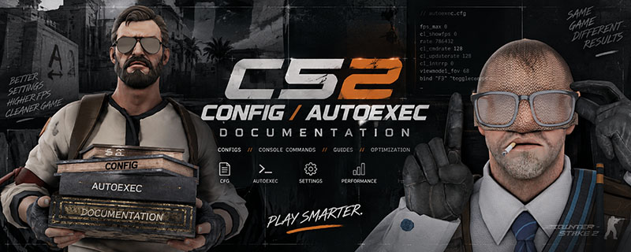

  

<h1 align="center">CS2 Advanced Config</h1>

  A modular Counter-Strike 2 autoexec by <b>sLix1337</b>. 
  Null-bind movement with three switchable modes, every key routed through a named verb.

  <b><a href="https://slix1337x.github.io/autoexec/">Read the docs</a></b> ·
  <a href="https://slix1337x.github.io/autoexec/scancodes.html">Scancodes</a> ·
  <a href="https://slix1337x.github.io/autoexec/dead-commands.html">Dead commands</a>

---

## Install

1. Copy everything inside `CS2 Advanced Config/` into `...\Counter-Strike Global Offensive\game\csgo\cfg\`
2. Launch CS2, or type `exec autoexec` in the console
3. Watch for `CONFIGURATION LOADED SUCCESSFULLY`

Nothing printed? Run `exec core/diag`.

Prefer a single download? Grab [SLX-CONFIG-v1.zip](https://github.com/slix1337x/autoexec/releases/latest) — the config and the Configurator in one folder.

## Configurator

Don't want all of it? Double-click `Configurator.bat`. Pick the modules you
want, rebind the keys, and it writes a tailored `cfg` folder plus a zip to
`builds/`. Every build is validated before a byte is written — undefined
aliases, missing exec targets, keys CS2 doesn't know and double-bound keys all
fail the build instead of shipping.

Needs nothing installed: it runs on the PowerShell that comes with Windows.
`CUSTOMIZE.bat` is the same builder without the window.

## What's in it

- Null-bind movement. Three modes on `KP_4`, master switch on `KP_5`, panic reset on `KP_0`
- 7 crosshair presets and 8 viewmodel positions, each on its own cycle key
- HUD accent colour shows which movement mode is live
- Every bind points at a `+slx_*` verb, so one edit changes every key that uses it

## Docs

The site covers CS2 configs in general: file locations, load order, syntax, aliases, state machines, a filterable convar list, practice commands and debugging. Part II documents this config.

Every command on it was typed into a live CS2 console and answered. Untested ones carry a *pending* badge instead of a confident guess.

## License

MIT. Do whatever you want with it.
